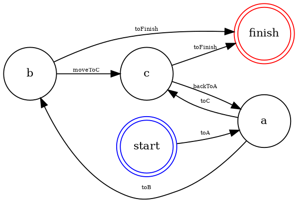

<p align="center">
  </img>
  <h3 align="center"><b>Finite State Machine for Go</b></h3>
</p>

<p align="center">
    <a href="https://travis-ci.org/zerjioang/go-fsm">
      
    </a>
    <a href="https://goreportcard.com/report/github.com/zerjioang/go-fsm">
       
    </a>
    <a href="https://github.com/zerjioang/go-fsm/blob/master/LICENSE">
        
    </a>
    <a href="https://godoc.org/github.com/zerjioang/go-fsm">
       
    </a>
</p>

Package **go-fsm** is a **zero-alloc**, high performance, pure go Finite State Machine implementation.

## Install

```bash
go get github.com/zerjioang/go-fsm
```

## TL;DR

```go
machine := fsm.New()

machine.AddState("start", fsm.NoStateEvents)
machine.AddState("a", fsm.NoStateEvents)
machine.AddState("b", fsm.NoStateEvents)
machine.AddState("c", fsm.NoStateEvents)
machine.AddState("finish", fsm.NoStateEvents)

machine.AddTransaction("toA", "start", "a")
machine.AddTransaction("toB", "a", "b")
machine.AddTransaction("toC", "a", "c")
machine.AddTransaction("backToA", "c", "a")
machine.AddTransaction("moveToC", "b", "c")
machine.AddTransaction("toFinish", "b", "finish")
machine.AddTransaction("toFinish", "c", "finish")

machine.SetInitialState("start")
machine.SetFinalState("finish")

machine.ChangeStateTo("a")

dot := machine.DotGraph()
fmt.Println(dot)
```

## Graphviz dot view

This library also allows developers to create raw **.dot** files as following, in an automatic way:



## Benchmarking

Always do benchmarking with your own data. Here are mine:

### For single thread version

```bash
BenchmarkFsm/instantiation-4         	30000000	        47.7 ns/op	  20.95 MB/s	       0 B/op	       0 allocs/op
BenchmarkFsm/instantiation-ptr-4     	10000000	       139 ns/op	   7.15 MB/s	      96 B/op	       2 allocs/op
BenchmarkFsm/add-state-4             	50000000	        24.2 ns/op	  41.36 MB/s	       0 B/op	       0 allocs/op
BenchmarkFsm/add-state-no-name-4     	100000000	        20.2 ns/op	  49.41 MB/s	       0 B/op	       0 allocs/op
BenchmarkFsm/add-state-no-event-4    	100000000	        23.7 ns/op	  42.12 MB/s	       0 B/op	       0 allocs/op
BenchmarkFsm/change-state-empty-4    	100000000	        22.2 ns/op	  45.00 MB/s	       0 B/op	       0 allocs/op
BenchmarkFsm/change-state-4          	30000000	        56.4 ns/op	  17.72 MB/s	       0 B/op	       0 allocs/op
BenchmarkFsm/has-state-false-4       	300000000	         4.37 ns/op	 228.80 MB/s	       0 B/op	       0 allocs/op
BenchmarkFsm/has-state-true-4        	200000000	         7.58 ns/op	 131.93 MB/s	       0 B/op	       0 allocs/op
BenchmarkFsm/to-dot-4                	  300000	      5310 ns/op	   0.19 MB/s	    2210 B/op	      29 allocs/op
PASS
```

## License

All rights reserved.

Redistribution and use in source and binary forms, with or without modification, are permitted provided that the following conditions are met:

 * Redistributions of source code must retain the above copyright notice, this list of conditions and the following disclaimer.
 * Redistributions in binary form must reproduce the above copyright notice, this list of conditions and the following disclaimer in the documentation and/or other materials provided with the distribution.
 * Uses GPL license described below

This program is free software: you can redistribute it and/or modify it under the terms of the GNU General Public License as published by the Free Software Foundation, either version 3 of the License, or (at your option) any later version.
